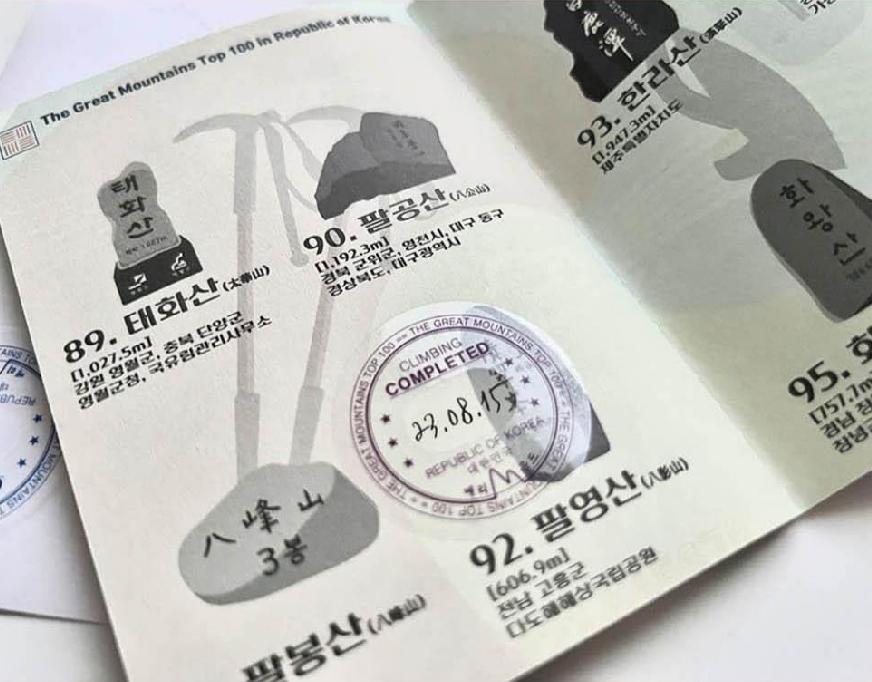
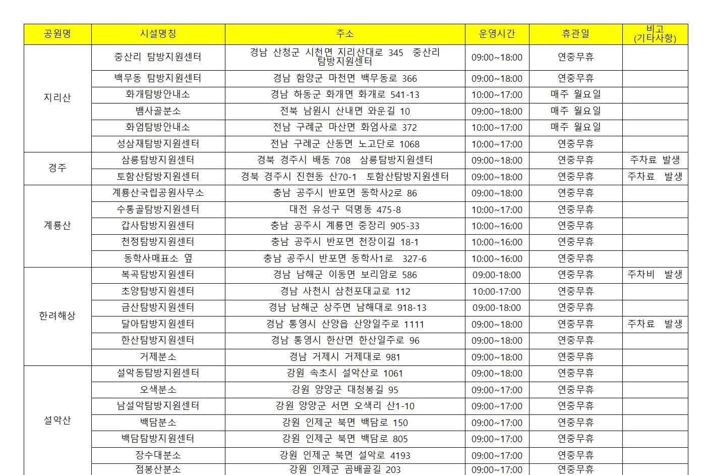
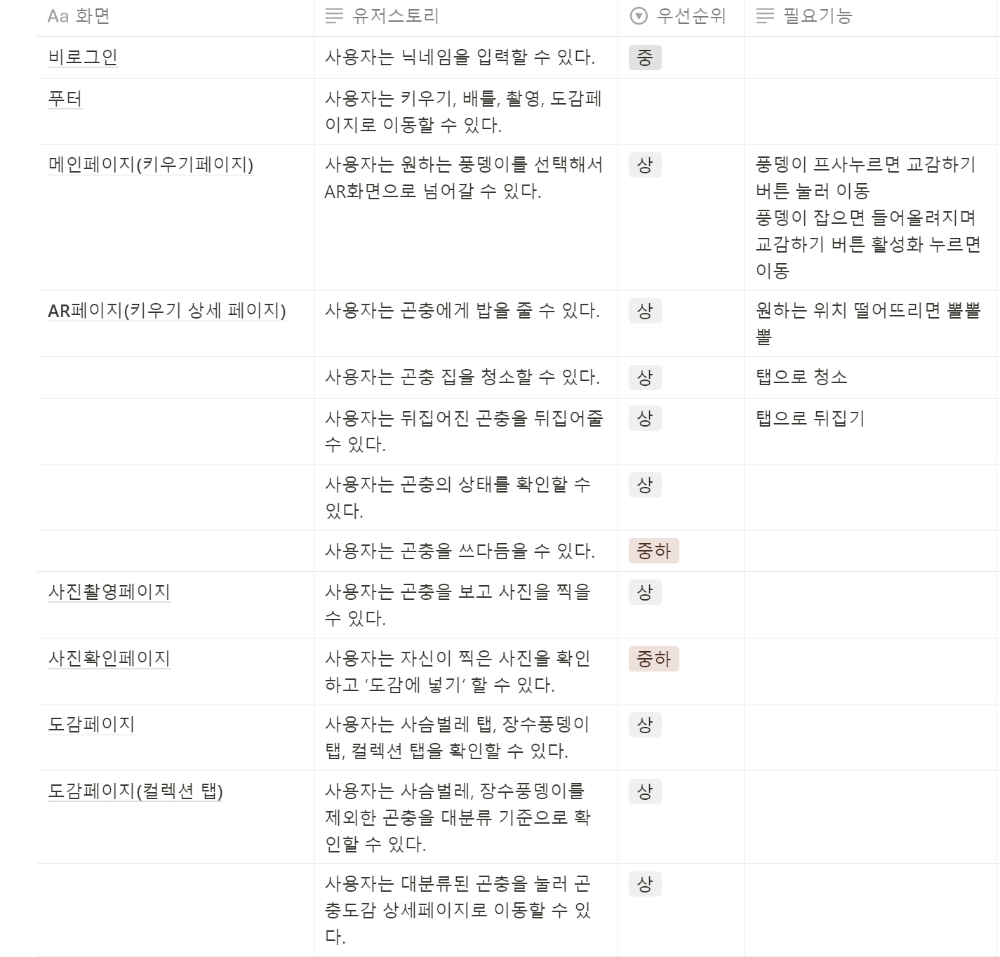
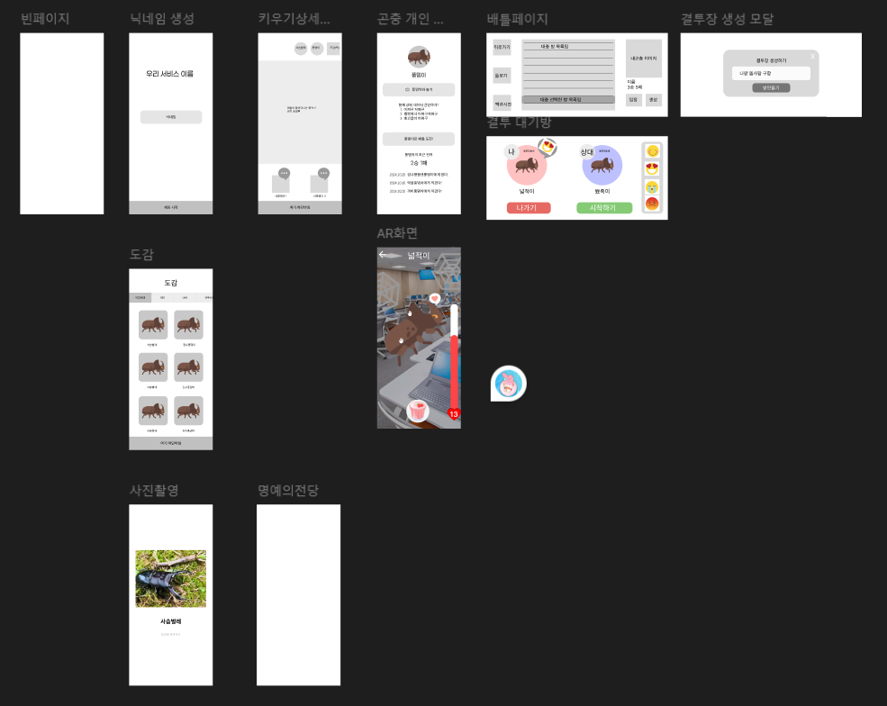

# 2024-10-22 (화)

### 아이디어 목록

1. 스탬프 투어 어플리케이션
2. 곤충 도감 + 배틀 시스템
3. 온라인 정원 또는 새장

### 아이디어 고도화

**1. 스탬프 투어 어플리케이션**

**등산 스탬프 투어**

**기획 배경**

- 많은 등산객들은 정상에 도달하는 목표를 달성하는 데에서 재미를 느낌
- 그래서 등산객에게 동기를 부여하고 수집요소를 결합한 등산 여권이 인기를 끌고 있다.

- 특히, SNS 로 '인증'을 하는 문화가 성행하면서 다양한 등산 스탬프를 모으고 이를 SNS에 인증하며 더욱 인기를 끌게 됨

- [해당 기사](http://www.ksmnews.co.kr/news/view.php?idx=326076) 를 참고하면 등산 스탬프 투어를 위한 여권이 매번 품절대란을 겪는 것을 볼 수 있다.

- 하지만, 스탬프 투어를 위한 여권을 구하기도 힘들 뿐더러 매번 국립공원 공단에서 이를 발급하고 스탬프를 관리해야한다.

  

  - 해당 사진을 보면 스탬프를 찍을 수 있는 시간이 정해져있고, 산마다 제각각이기에 사용자 입장에서도 불편함을 느낄 수있다.

- **이러한 불편함을 해소하고자 등산 스탬프 여권을 디지털화 하고자 함**

 

**추가할 만 한 부가 기능**

1. 해당 등산 경로 추천
   (산림청 등산로 정보: 난이도, 구간별 거리, 분 등)
2. 등산 종료 후 경로 분석
3. 여권 공유 기능 (이미지로 저장해서 공유하게끔)
4. 타임스탬프 기능 (타임스탬프 어플을 추가로 다운받지 않고, 정상에서 어플을 통해 인증샷찍으면 자동으로 타임스탬프 설정할 수 있게)
5. [SNS 연동기능](https://developers.facebook.com/docs/instagram-platform/sharing-to-stories?locale=ko_KR)

# 2024-10-23 (수)

### 아이디어 회의

기획 : 어린이 곤충 도감 및 육성 배틀 서비스

### 1. **프로젝트 개요**

아이들이 곤충을 가까이에서 관찰하고 돌보며 곤충 생태계를 학습할 수 있는 교육용 애플리케이션입니다. **사용자는 AI로 곤충을 식별하고, 이를 AR로 구현하여 생태계 재활용 개념을 학습하며, 곤충 돌보기 및 배틀과 같은 상호작용을 통해 집중력 향상, 스트레스 완화, 불안 감소 등 인지 기능 향상을 도모합니다.** 이 프로젝트는 교육과 재미를 결합한 곤충 치유 프로그램을 통해 어린이들에게 자연에 대한 흥미를 유발하고, 심리적 안정과 인지 능력을 강화할 수 있는 기회를 제공합니다.

### 2. **주요 기능**

1. **곤충 촬영 및 AI 식별**
   - 사용자는 앱을 통해 곤충을 촬영하면, AI가 곤충의 종류를 실시간으로 식별하고 정보와 함께 사용자 도감에 저장합니다.
   - 각 곤충의 생태적 특징, 서식지, 곤충의 생활사 등 교육적인 정보가 제공됩니다.
2. **도감 저장 및 3D 모델링**
   - 도감에 저장된 곤충은 3D 모델로 변환되어 AR 환경에서 구현되며, 아이들은 곤충을 다양한 각도에서 관찰할 수 있습니다.
   - 곤충의 성장 과정과 생태적 역할을 체험하며, 곤충 생태계를 쉽게 이해할 수 있는 기회를 제공합니다.
3. **AR 돌보기 기능**
   - 곤충에게 적절한 먹이를 주고 돌보며, 실시간 상호작용을 통해 곤충의 건강 상태를 관리할 수 있습니다.
   - 이러한 활동은 곤충과의 교감을 통해 정서적 안정감을 제공하고, 아이들의 집중력과 책임감을 키울 수 있도록 도와줍니다.
4. **친구와의 AR 배틀**
   - 사용자는 친구들과 함께 곤충 배틀을 즐길 수 있으며, 각 곤충의 고유한 특성을 활용해 전략적인 배틀을 진행할 수 있습니다.
   - 이러한 상호작용은 아이들에게 경쟁과 협력의 가치를 배울 수 있는 기회를 제공하며, 게임의 즐거움을 통해 스트레스 해소와 인지적 자극을 얻을 수 있습니다.

### 2.2 추가 기능

### 2.2.1 곤충 희귀도 시스템

- **설명**: 각 곤충에 희귀도를 부여하여 (일반, 희귀, 전설 등) 아이들이 더 다양한 곤충을 모으는 동기를 부여.
- **희귀도 등급**:
  - **일반(Common)**: 흔히 볼 수 있는 곤충.
  - **희귀(Rare)**: 특정 지역이나 계절에만 발견할 수 있는 곤충.
  - **전설(Legendary)**: 매우 드물게 발견되는 곤충. 특정 이벤트나 특별한 장소에서만 등장.
- **희귀도 부여 방식**:
  - AI가 곤충의 생태 정보, 발견 빈도 등을 바탕으로 희귀도를 자동으로 결정.
  - 특별한 날이나 이벤트 기간에는 한정판 곤충이 추가될 수 있음.
- **사용자 동기 부여**:`

  - 높은 희귀도를 가진 곤충일수록 배틀에서 유리.
  - 도감에 희귀한 곤충을 모으는 재미와 성취감 제공.

- ~~성장한 곤충은 배틀에서 공격력과 방어력 증가.~~

### 2.3 추가 기능을 통한 사용자 경험 향상

- **수집 욕구 자극**: 희귀도를 통해 곤충 수집에 대한 동기 부여가 강화되며, 레벨업과 성장 시스템을 통해 곤충을 더 오랫동안 관리하고 키울 수 있는 재미 제공.
- **경쟁 요소 강화**: 배틀 모드에서 성장한 곤충과 희귀 곤충은 더 강력한 힘을 발휘하여 승리에 도움이 됨. 이를 통해 사용자 간의 경쟁 요소가 증가.

### 3. **프로젝트 목표**

- **곤충에 대한 흥미와 교육 효과**: 아이들이 곤충을 직접 관찰하고 돌보는 경험을 통해 자연에 대한 호기심을 키우고, 곤충의 생태계를 학습할 수 있는 교육적 기회를 제공합니다.
- **인지 기능 및 정서적 안정 향상**: 곤충 돌보기 및 AR 상호작용을 통해 집중력, 책임감, 스트레스 감소, 불안 완화와 같은 인지적, 정서적 기능 향상 효과를 목표로 합니다.
- **심리적 치유 효과 강화**: 살아있는 곤충과의 상호작용을 통한 자연 교감은 심리적 안정과 치유 효과를 가져오며, 이는 정서적 건강을 증진시킬 수 있습니다.

###

### 4. **기대 효과**

- **심리적 및 인지적 치유**: 곤충을 직접 돌보고 상호작용하는 과정에서 아이들의 스트레스 감소, 집중력 향상, 불안 감소 등의 긍정적인 효과가 기대됩니다.
- **자연과의 교감**: 곤충을 통한 교육적 체험은 자연에 대한 이해를 높이고, 환경 보호 의식을 강화시킬 수 있습니다.
- **체험 기반 교육**: 곤충의 생태계와 서식 환경을 AR로 직접 경험함으로써, 아이들이 자연스럽게 환경과 생태계를 학습하는 효과를 얻을 수 있습니다.
- **사회적 상호작용 증대 :** 배틀 모드와 곤충 교환 시스템을 통해 친구들과의 상호작용을 촉진하고, 협동심과 경쟁심을 기를 수 있습니다.

## 기능 구체화

### 1-1. 키우기 페이지

- 키우기 : 3마리까지
- 커스터마이징 : 뿔이나 색이나 뭐 그런거
- 애들이 2D 배경에서 돌아다니고 있음 (여기선 그냥 구경)
  - 청소 (공통요소)
- 이름표도 따로 있어서 이름표를 누르거나 애들을 누르면 AR화면으로 넘어갈수 있음
  - 누구누구랑 교감하기가 뜨면서 AR로 넘어가게
- 밥주고 키우는건 AR 모드에서 함

### 1-2. AR 화면

- 밥주는거 젤리 까는 동작을 통해 밥줌
  - 밥너무많이주면 애정 깎이게
- 물은 안줌
- 청소하기 ⇒ 화면에 거미줄 쳐져있으면 슥삭슥삭 청소 (탭)
- 뒤집어주기

### 1-3. 성장 (Stat)

- 일퀘 (육성) 을 통해 성장
- Ability Point Naming : 적응력(뒤집기), 굶주림(밥주기), 청결도(청소), 사랑(얼마나 자주오는지)
  - 체력: 레벨로 통일
  - 공격력: 밥주는거 포만감으로
  - 피로도?

 

# 2024-10-24(목)

오늘 한 일: 개발 역할 분담, 기능 구체화, 유저스토리 제작, 와이어프레임 제작

1. userstory
   

 

2. wireframe
   
