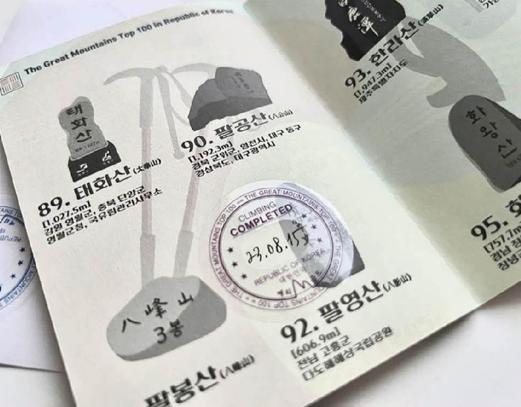
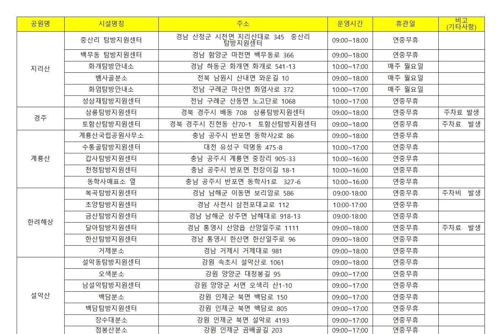

# 2024-10-22 (화)

### 아이디어 목록

1. 스탬프 투어 어플리케이션
2. 곤충 도감 + 배틀 시스템
3. 온라인 정원 또는 새장

### 아이디어 고도화

**1. 스탬프 투어 어플리케이션**

**등산 스탬프 투어**

**기획 배경**

- 많은 등산객들은 정상에 도달하는 목표를 달성하는 데에서 재미를 느낌
- 그래서 등산객에게 동기를 부여하고 수집요소를 결합한 등산 여권이 인기를 끌고 있다.

- 특히, SNS 로 '인증'을 하는 문화가 성행하면서 다양한 등산 스탬프를 모으고 이를 SNS에 인증하며 더욱 인기를 끌게 됨

- [해당 기사](http://www.ksmnews.co.kr/news/view.php?idx=326076) 를 참고하면 등산 스탬프 투어를 위한 여권이 매번 품절대란을 겪는 것을 볼 수 있다.

- 하지만, 스탬프 투어를 위한 여권을 구하기도 힘들 뿐더러 매번 국립공원 공단에서 이를 발급하고 스탬프를 관리해야한다.

  

  - 해당 사진을 보면 스탬프를 찍을 수 있는 시간이 정해져있고, 산마다 제각각이기에 사용자 입장에서도 불편함을 느낄 수있다.

- **이러한 불편함을 해소하고자 등산 스탬프 여권을 디지털화 하고자 함**

 

**추가할 만 한 부가 기능**

1. 해당 등산 경로 추천
   (산림청 등산로 정보: 난이도, 구간별 거리, 분 등)
2. 등산 종료 후 경로 분석
3. 여권 공유 기능 (이미지로 저장해서 공유하게끔)
4. 타임스탬프 기능 (타임스탬프 어플을 추가로 다운받지 않고, 정상에서 어플을 통해 인증샷찍으면 자동으로 타임스탬프 설정할 수 있게)
5. [SNS 연동기능](https://developers.facebook.com/docs/instagram-platform/sharing-to-stories?locale=ko_KR)
