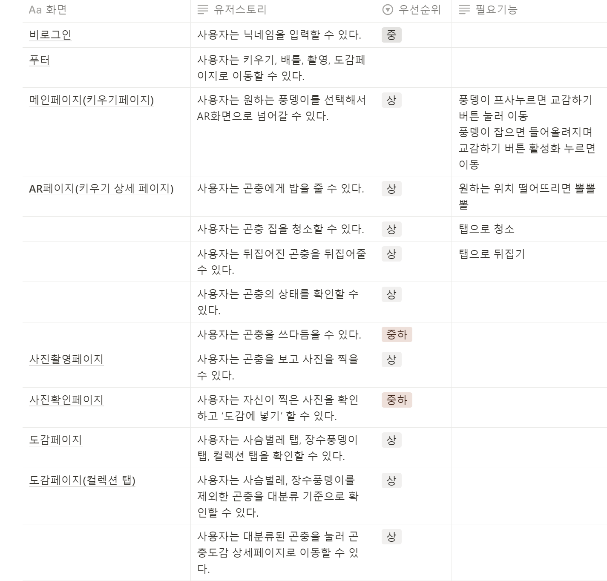

# 2024-10-24(목)

오늘 한 일: 개발 역할 분담, 기능 구체화, 유저스토리 제작, 와이어프레임 제작

1. userstory
   

 

2. wireframe
   

 

# 2024-10-25(금)

중간 발표 : 기획 배경 및 근거 + 간단한 와이어프레임

**우리 발표 질문**

- 교육 목적에 가깝다보니 먹이사슬이 기반이 되어야 할 것 같은데 고려가 되었는가?
- 아이가 자연 환경에서 직접 곤충을 잡아와야 대결을 할 수 있는가?
  - 인터넷에서 찍는거는 어떻게 막을 것이냐?
- 실제로 곤충들이 싸우는 걸 보면 날라가고 하는데 배틀 환경에서는 어떻게 반영할 것인가?
- 생명의 소중함을 배울 수 있다고 했는데 어떤 점에서 생명의 소중함을 배울 수 있는지 와닿지 않는다.

 

**우리 발표 피드백**

- 근거자료가 부족 ← 너무 1차원적임
  ㄴ 도표에 출처가 없음. 연구 논문이나 이런 걸 활용했으면
- 영상을 활용하고, 느낌을 보여주려고 와이어프레임을 보여준 건 좋았다고 생각
- 기획적인 측면보다는 아이디어 면에서 좋음
- 창업 수준 이상으로 해야함.
- 일단 이 정도만 했어요 이런 느낌은 놉.
- 곤충이 너무 많은데 이걸 어떻게 전략적으로 접근할까
- 특이한 걸 찍고 싶을텐데 평범한 것만 지원해준다면 과연 사진을 찍고 싶을까?
  ㄴ 이런 경우 UI/UX를 어떻게 표현할 것인지
- 사용자를 계속 고려해서 기획
- 아이디어가 좋지 기획이 좋다고 하진 않았음
- 단순 배틀/다마고치로 가면 절대안됨 진짜 키우는느낌으로
