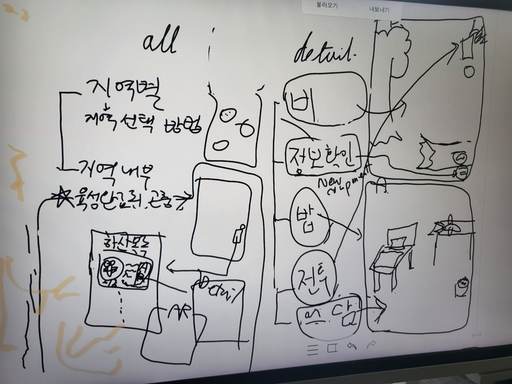

# 2024-10-29(화)

### 1. 세계관 구축

서비스 명 : 벅토피아 (BugTopia)

우리 서비스를 하나의 '나라'에 비유한다. (곤충나라)

채집: 사용자가 곤충 채집을 하는 걸 입국 심사 과정에 비유한다.

- 채집에 성공할경우 입국 심사 승인, 실패할 경우 입국 심사 거절
- 시각적인 디자인도 여권을 많이 참고한다.

- 입국 심사가 거절되는 경우: 해충일 경우 (예시: 병균을 옮기는 이유로 입국 거절)

### 2. 곤충 목록

- 동물의숲 곤충 도감 목록 따오기
- 최대한 대중적이고, 많은 종류의 곤충 목록을 지원하고 있음
- 곤충 박물관 전시중인 목록을 참고해서 도감을 구성한다.
- 우리 나라에서 볼 수 있는 곤충은 대부분 지원하도록 한다.
- 구매한 Asset 에서 색, 약간의 부위를 커스텀해서 다른 종임을 구분한다.

촬영 -> 곤충 종류 판단 -> 키울 수 있는 여부 판단 (입국심사) -> 승인된 경우 우리 서비스에서 키울 수 있다

### 3. 레벨 시스템

- 육성을 할수록 크기가 커진다.
- 색 변경은 색깔로 종을 구분하는 경우가 있어서 우선 배제한다.

### 4. 배틀 시스템

- 배틀 시스템은 유저vs유저 는 없앤다. (너무 어색함)
- 키우기 도중에 경쟁을 위해 다른 경쟁자가 등장한다.
- 자연의 섭리 속에서 배틀을 녹여낸다.
- 배틀을 할 때 우리의 곤충이 위기를 겪을 경우 유저가 도와줄 수 있는 기능을 추가한다.
- 먹이 경쟁 -> 영역 경쟁 -> 번식 경쟁 순서로 이벤트가 등장한다.
- 번식 경쟁을 마친 경우에는, 결혼을 하며 떠나간다.
- 떠난 곤충들은 게임 내 스마트폰을 통해 연락하고 놀아줄 수 있다.
- 배틀에서는 유저가 지는 경우는 없다. (다만 강해질 수록 더 금방 이긴다.)

 
 

---

### 메인화면 유저플로우

 
 

---

### 키우기 페이지 구분

- 전체 목록과 각각의 곤충 디테일 페이지로 구분
